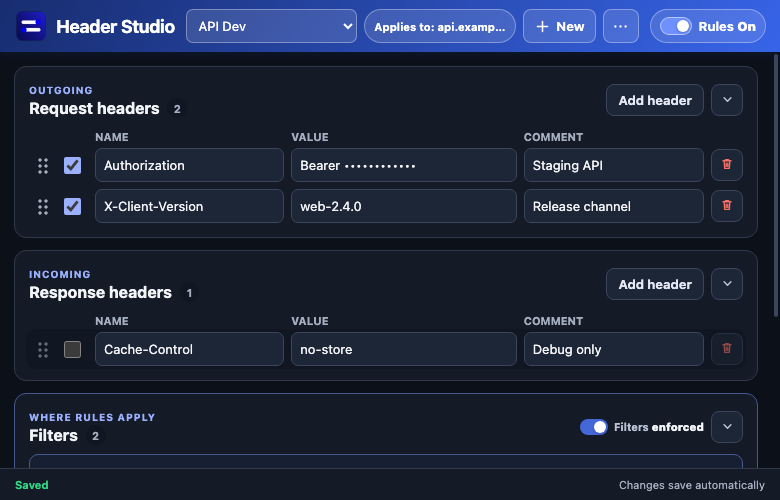
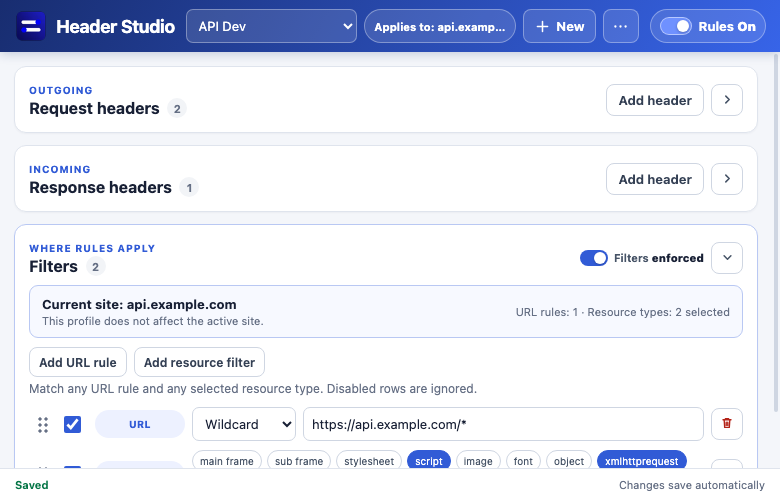

# Header Studio

Header Studio is a focused Chrome extension for modifying request and response headers with profiles, precise request filtering, header comments, and portable JSON backups.

It is a clean Manifest V3 implementation designed for local sideloading. The extension makes no network requests of its own, includes no analytics or third-party dependencies, and stores its configuration in `chrome.storage.local`.

## Screenshots

### Header editing



### URL and resource filtering



## Features

- Modify request and response headers with Chrome's Declarative Net Request API.
- Organize rules into independently configurable profiles.
- Limit a profile by URL patterns and resource types.
- Start new filters from the active tab's site automatically.
- Add local notes to header rows.
- Reorder rows with drag and drop; later duplicate headers take precedence.
- Pause all rules globally or bypass filters for an individual profile.
- Import Header Studio backups and compatible legacy ModHeader exports.
- Export complete or redacted JSON backups.
- Follow the system theme by default, with light and dark overrides.
- See effective scope, inline validation, save status, and undoable deletions directly in the popup.

## Install in Chrome

1. Download or clone this repository.
2. Open `chrome://extensions` in Chrome.
3. Enable **Developer mode**.
4. Select **Load unpacked**.
5. Choose the repository directory containing `manifest.json`.
6. Pin **Header Studio** from Chrome's extensions menu.

After pulling an update, return to `chrome://extensions` and select the extension's reload button.

## How scope works

Each profile has URL filters and optional resource-type filters:

- Multiple URL rules are matched as alternatives (OR).
- Multiple selected resource types are matched as alternatives (OR).
- When both groups exist, a request must match a URL rule **and** a selected resource type (AND).
- An enabled resource filter with no selected types matches no requests.
- Blank URL rules are ignored while being edited.
- Bypassing filters preserves the filter configuration but applies enabled headers to all HTTP and HTTPS requests.
- Turning **Rules Off** pauses every profile without deleting its configuration.

The scope pill in the header always reports the profile's effective scope. **All sites** is highlighted while rules are active so broad configurations are difficult to overlook.

New profiles can target the active site or all sites. Adding a URL filter pre-fills a wildcard for the active tab's origin, such as `https://example.com/*`.

## Profiles and duplicate headers

Only the selected profile is active. Each profile keeps its own headers, filters, and filter-enforcement state.

When multiple enabled rows use the same header name, the last enabled row wins. Earlier rows display **Overridden by a later enabled row**, and drag-and-drop reordering updates that warning immediately.

## Import and export

The importer accepts:

- Header Studio backups;
- arrays of legacy profiles;
- individual legacy ModHeader profile objects;
- objects containing a `profiles` array;
- JSON that was stringified more than once by an older backup tool.

Imports can add profiles or replace the current collection. Replacement requires confirmation and creates a safety backup before any profiles are changed. Input is limited to 2 MB, 50 profiles, 200 request or response headers per profile, and 100 filters per profile.

> [!WARNING]
> Complete backups may contain credentials, authorization tokens, and local notes. Treat them as secrets. Use **Export redacted** before sharing a backup; it replaces header values and notes with `[REDACTED]`.

## Permissions and privacy

| Permission | Why it is needed |
| --- | --- |
| `activeTab` | Suggest the current site's URL when creating profiles and filters. |
| `declarativeNetRequestWithHostAccess` | Apply request and response header modifications. |
| `storage` | Save profiles and preferences locally. |
| `<all_urls>` | Allow user-created rules to target any HTTP or HTTPS site. |

Chrome displays a broad site-access warning because an extension cannot modify headers on arbitrary user-selected sites without matching host access. Header Studio does not transmit stored rules, browsing activity, or backup contents.

## Development

There is no build step and no runtime dependency to install. Chrome 101 or newer is required.

Run the syntax checks and test suite with:

```sh
npm run check
```

Run only the unit tests with:

```sh
npm test
```

Project layout:

```text
manifest.json       Extension manifest and permissions
background.js       Rule compilation and browser rule synchronization
popup.html          Popup structure and dialogs
popup.css           Responsive light/dark popup styling
popup.js            Profile editor and interaction logic
lib/core.js         State normalization, import/export, and rule compilation
test/core.test.js   Core behavior and compatibility tests
assets/             Extension icons and logo
```

## Security

Header rules can contain sensitive credentials and can change how websites behave. Keep profiles narrowly scoped, verify the **Applies to** indicator before enabling a rule, and never commit real tokens or full backup files to source control.

If you discover a security issue, report it privately to the repository owner rather than opening a public issue with reproduction credentials.

## Acknowledgements

Header Studio was inspired by the profile-and-filter workflow of [ModHeader](https://github.com/cloudbuy/modheader), while using an independent, deliberately smaller Manifest V3 implementation.

## License

[MIT](LICENSE)
